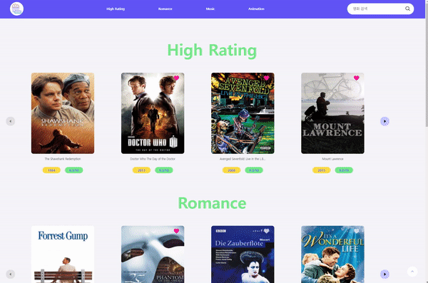
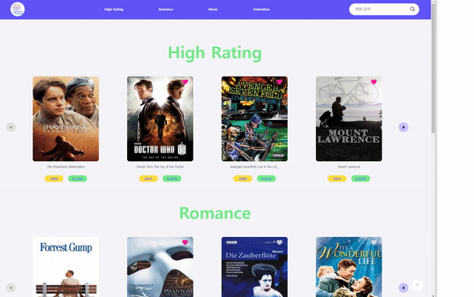
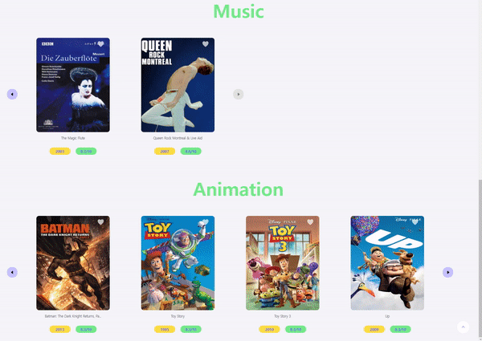
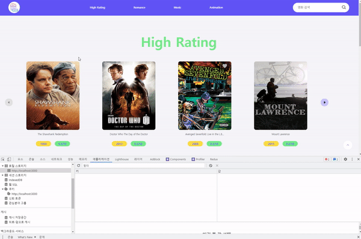

# 📡 what do you see(뭐볼래)

## 💁‍♂️ Introducing Project

> -   내가 좋아하는 영화, 내가 앞으로 볼 영화 목록을 북마크 해놓는 어플리케이션
> -   Open API를 활용해서 인기별 장르별 영화 목록과 정보를 제공
> -   타이틀 클릭 시 상세 영화 정보를 제공
> -   상단의 네비게이션을 이용하면 카테고리를 구분하여 영화 데이터를 가져와서 화면에 렌더링
> -   슬라이드를 이용해서 좌, 우 버튼 이동 가능
> -   슬라이드의 처음과 끝으로 이동시 버튼이 disable 되어 이동 불가능
> -   브라우저 크기를 확인하여 화면에 맞게 영화 아이템 개수를 표기
> -   하트 버튼 클릭 시 로컬스토리지로 영화의 id가 저장되어 새로고침하여도 유지
> -   검색창을 이용해서 검색 결과에 맞는 결과를 영화 목록이 확인 가능

## 📅 Date / Developer

> -   2022.06.01 ~ 2022.06.15 15(2주)
> -   1인 프로젝트

## 📌 Point

> -   Open API 활용
> -   슬라이드 컴포넌트
> -   로컬 스토리지

## 🛠 Using Skill

> -   HTML5
> -   CSS3
> -   React
> -   Recoil

## 🌐 API

> -   [movie API](https://yts.mx)

## 📁 Folder Structure

```
├─components
│  ├─Asset : scrollTop 버튼 컴포넌트
│  ├─Atom : 네비게이션에 들어갈 카테고리 정보를 전역에서 접근 가능 데이터
│  ├─Loading : 페이지 전환시 로딩 사용하는 로딩 컴포넌트
│  ├─Movie : 영화 데이터 패칭, 영화 아이템 컴포넌트
│  ├─Navigation : 상단 네비게이션 컴포넌트
│  └─Slider : 슬라이드 컴포넌트
└─routes

```

## 🔧 How To Use?

#### start

```
npm install
```

## 👓 Screen

<p>장르별로 영화 목록을 제공, 타이틀 클릭 시 영화 상세 정보 제공</p>
<center>
  
</center>

<p>브라우저 사이즈를 조절하여 슬라이드 개수 조정</p>
<center>
  
</center>

<p>좌, 우 버튼 클릭 시 처음, 끝은 이동 불가능 설정, 크기 조정 후에도 버튼 이동 가능</p>
<center>
  
</center>

<p>하트를 클릭하면 local storage에 id 값 저장, 새고로침하여도 유지</p>
<center>
  
</center>
